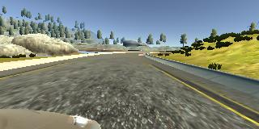
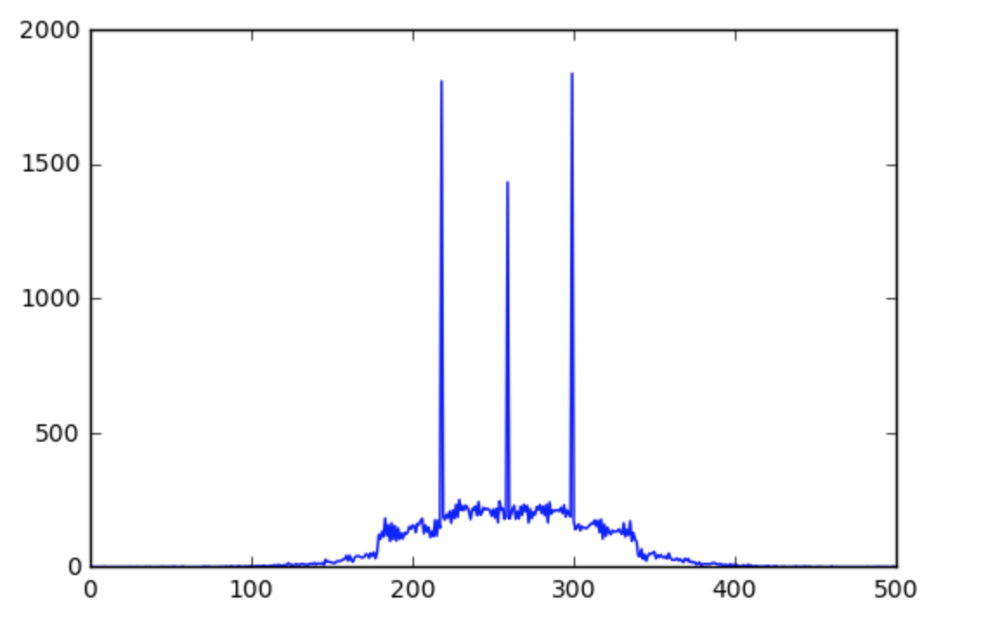
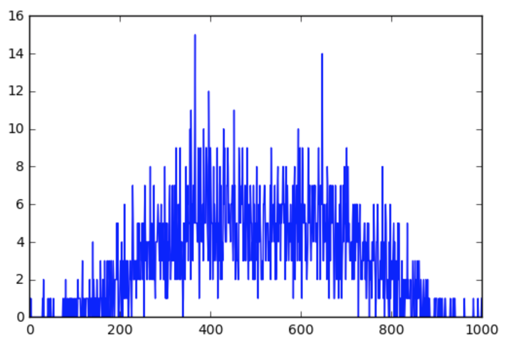

**Behavioral Cloning** 

*Introduction

This project is using "behaviour cloning" concept to drive a car on the track in a simulator.

---

**Behavioral Cloning Project**

The goals / steps of this project are the following:
* Use the simulator to collect data of good driving behavior
* Build, a convolution neural network in Keras that predicts steering angles from images
* Train and validate the model with a training and validation set
* Test that the model successfully drives around track one without leaving the road
* Summarize the results with a written report


[//]: # (Image References)

**Original Image** - </br></br>
**Trimmed Image** - </br></br>
**Adjusted Brightness** - </br></br> 
**Right Translated** -</br> </br>
**Flipped Image** - </br> </br>
</br>**Resized to 64x64** - </br>


---
**Files Submitted**

*1. Submission includes all required files and can be used to run the simulator in autonomous mode*

My project includes the following files:
* model.py containing the script to create and train the model
* drive.py for driving the car in autonomous mode
* model.h5 containing a trained convolution neural network 
* writeup_report.md summarizing the results

*2. Submission includes functional code*
Using the Udacity provided simulator and my drive.py file, the car can be driven autonomously around the track by executing 
```sh
python drive.py model.h5
```

*3. Submission code is usable and readable*

The model.py file contains the code for training and saving the convolution neural network. The file shows the pipeline I used for training and validating the model, and it contains comments to explain how the code works.

**Model Architecture Summary**

*1. An appropriate model architecture has been employed*

Here are the layer details - 

1. Lambda 
2. 3x3 Convolution
3. Activation Unit (ELU)
4. Max pooling 2x2
5. 3x3 Convolution
6. Activation Unit (ELU)
7. Max pooling 2x2
8. 3x3 Convolution
9. Activation Unit (ELU)
10. Max pooling 2x2
11. Flatten
12. FC (1024)
13. Dropout (50%)
14. FC (128)
15. Dropout (50%)
16. FC (64)
17. Dropout (50%)
18. FC - Output (1)

*2. Attempts to reduce overfitting in the model*

The model contains dropout layers in order to reduce overfitting. Check the Dropout layers described in the above section. 

The model was trained and validated on different data sets to ensure that the model was not overfitting. The model was tested by running it through the simulator and ensuring that the vehicle could stay on the track.

*3. Model parameter tuning*

The model used an adam optimizer, so the learning rate was not tuned manually.

*4. Appropriate training data*

Training data was chosen to keep the vehicle driving on the road. I used a combination of center lane driving, recovering from the left and right sides of the road. For details about how I created the training data, see the next section. 

**Model Architecture and Training Strategy**

*1. Solution Design Approach*

The overall strategy for deriving a model architecture was to collect right amount of data and balance the data during the training cycles.

My first step was to use a convolution neural network model with 3 convolution layers and 3 fully connected layers. I thought this model might be appropriate because it had enough convolution layers to store the required image information.

In order to gauge how well the model was working, I split my image and steering angle data into a training and validation set. I found that my first model had a low mean squared error on the training set but a high mean squared error on the validation set. This implied that the model was overfitting. 

To combat the overfitting, I modified the model to add dropouts after each layer. But that was not letting the model to learn properly. Also I used ELU (Exponential Linear Units) as the activation function as it is know to have better results.

The final step was to run the simulator to see how well the car was driving around track one. There were a few spots where the vehicle fell off the track specially at the steep curves, to improve the driving behavior in these cases, I added logic to properly balance the data based on the input angles.

At the end of the process, the vehicle is able to drive autonomously around the track without leaving the road.

*2. Final Model Architecture*

The final model architecture consisted of a 3 convolution neural network layers with the following layers and layer sizes. Here is a visualization of the architecture -


####3. Creation of the Training Set & Training Process

To capture good driving behavior, I first recorded two laps on track one using center lane driving. Here is an example image of center lane driving:


I then used image translation and left and right images to make model learn how to recover from sides of the track. While using these translated/left/right image the angle was also adjusted to drive the model to the center of the lane. Here are the corresponding left and right images :




Then I repeated this process on track two in order to get more data points.

To augment the data sat, I also flipped images and angles as this would allow the model to be more generalized instead of getting biased towards one direction. For example, here is an image that has then been flipped:


Also, to balance the data I plotted the angles of all the generated images in a histogram and noticed that there was a huge bias towards the ZERO and corresponding LEFT and RIGHT images.



Because of this bias the model was constantly learning to keep the angles ZERO. So, I used thresholding and randomization to balance the dataset. Here is how the angles histogram looked after proper balancing - 



I finally randomly shuffled the data set and put 10% of the data into a validation set. 

I used this training data for training the model. The validation set helped determine if the model was over or under fitting. The ideal number of epochs was 10 but I kept saving the model after each epoch along with the error rate. I used an adam optimizer so that manually training the learning rate wasn't necessary.

Finally car was able to drive successfully on the simulator track!
