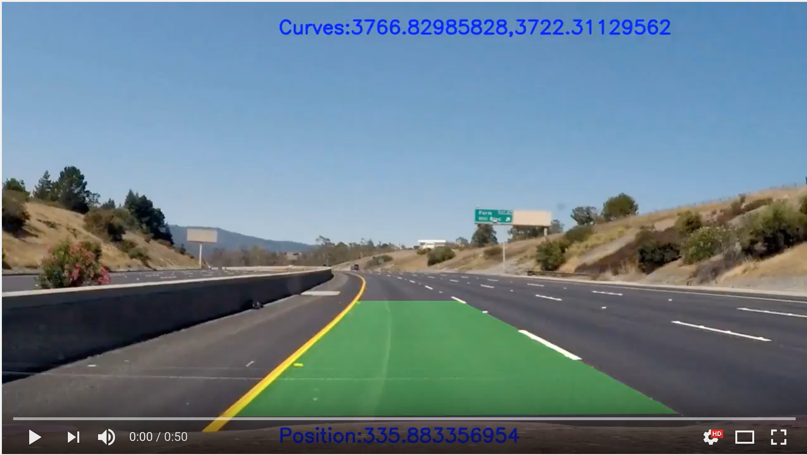

## Advanced Lane Finding
[](http://www.udacity.com/drive)

In this project, your goal is to write a software pipeline to identify the lane boundaries in a video, but the main output or product we want you to create is a detailed writeup of the project.  Check out the [writeup template](https://github.com/udacity/CarND-Advanced-Lane-Lines/blob/master/writeup_template.md) for this project and use it as a starting point for creating your own writeup.  

##Advanced Lane Finding Project

The goals / steps of this project are the following:

* Compute the camera calibration matrix and distortion coefficients given a set of chessboard images.
* Apply a distortion correction to raw images.
* Use color transforms, gradients, etc., to create a thresholded binary image.
* Apply a perspective transform to rectify binary image ("birds-eye view").
* Detect lane pixels and fit to find the lane boundary.
* Determine the curvature of the lane and vehicle position with respect to center.
* Warp the detected lane boundaries back onto the original image.
* Output visual display of the lane boundaries and numerical estimation of lane curvature and vehicle position.

[image0]: ./output_images/chessboard.png "Chessboard"
[image1]: ./output_images/un-distort.png "Undistorted"
[image2]: ./output_images/thresh-gradient-x.png "Threshold X Gradient"
[image3]: ./output_images/thresh-gradient-y.png "Threshold X Gradient"
[image4]: ./output_images/mag-gradient.png "Magnitude Gradient"
[image5]: ./output_images/direction-gradient.png "Direction Gradient"
[image6]: ./output_images/combined-gradient.png "Combined Gradient"
[image7]: ./output_images/color-binary.png "Color Gradient"
[image8]: ./output_images/s-binary.png "S Binary"
[image9]: ./output_images/final-binary.png "Final Binary with Threshold and S Channel"
[image10]: ./output_images/masked.png "Masking"
[image11]: ./output_images/perspective.png "Perspective Transform"
[image12]: ./output_images/histogram.png "Histogram"
[image13]: ./output_images/lane-detect.png "Lane Detection"
[image14]: ./output_images/final-output.png "Final Warpped Image"
[video15]: ./project_video_output.mp4 "Video"

## Project Details

---
Here are the image processing steps followed for detecting the lane lines along with the processed output at each stage.

**Camera Calibration**

The code for this step is contained in the first code cell of the jupyter notebook located in "./camera_calibration.ipynb".  

I start by preparing "object points", which will be the (x, y, z) coordinates of the chessboard corners in the world. Here I am assuming the chessboard is fixed on the (x, y) plane at z=0, such that the object points are the same for each calibration image.  Thus, `objp` is just a replicated array of coordinates, and `objpoints` will be appended with a copy of it every time I successfully detect all chessboard corners in a test image.  `imgpoints` will be appended with the (x, y) pixel position of each of the corners in the image plane with each successful chessboard detection.  

I then used the output `objpoints` and `imgpoints` to compute the camera calibration and distortion coefficients using the `cv2.calibrateCamera()` function.  I applied this distortion correction to the test image using the `cv2.undistort()` function and obtained this result: 

![alt text][image0]

###Pipeline (single images)

**Gradient Thresholding**

To demonstrate this step, I will describe how I apply the distortion correction to one of the test images like this one:
![alt text][image1]

I used a combination of color and gradient thresholds to generate a binary image (check `lane_util.py` and CarND-Advanced-Lane-Lines.ipynb).  
Here's an example of my output for this at every step - 

![alt text][image2]

![alt text][image3]
![alt text][image4]
![alt text][image5]
![alt text][image6]
![alt text][image7]

**S Channel Thresholding**
Also, I transformed the image into different colour space - HLS and applied "S Channel" thresholding - 

![alt text][image8]

**Final Binary with Threshold and S Channel**
![alt text][image9]

**Masking**
I also applied masking to the image to remove the redundant sections of the image.
![alt text][image10]

**Perspective Transform**
The code for my perspective transform includes a function called `apply_perspective()`, which appears in the file `lane_util.py`.  The `apply_perspective()` function takes as inputs an image (`img`), and uses source (`src`) and destination (`dst`) points to transpose the image.  I chose the hardcode the source and destination points in the following manner:

```
src = np.float32(
    [[(img_size[0] / 2) - 55, img_size[1] / 2 + 100],
    [((img_size[0] / 6) - 10), img_size[1]],
    [(img_size[0] * 5 / 6) + 60, img_size[1]],
    [(img_size[0] / 2 + 55), img_size[1] / 2 + 100]])
dst = np.float32(
    [[(img_size[0] / 4), 0],
    [(img_size[0] / 4), img_size[1]],
    [(img_size[0] * 3 / 4), img_size[1]],
    [(img_size[0] * 3 / 4), 0]])

```
This resulted in the following source and destination points:

| Source        | Destination   | 
|:-------------:|:-------------:| 
| 300, 661      | 300, 720        | 
| 560, 476      | 300, 0      |
| 734, 476     | 700, 0      |
| 1010, 656      | 700, 720        |

I verified that my perspective transform was working as expected by drawing the `src` and `dst` points onto a test image and its warped counterpart to verify that the lines appear parallel in the warped image.

![alt text][image11]

Then I plotted the identified points on histogram.

![alt text][image12]

Then I used the peaks in the histogram to pick the 2 prominent lane line points and fit my lane lines with a 2nd order polynomial kinda like this:

![alt text][image13]

**Un-Warp Image**
I un wrapped the image using the inverse matrix and warped image generated in the previous section. This is implemented in my code in `lane_util.py` in the function `unwarp_image()`.  Here is an example of my result on a test image:

![alt text][image14]

---

###Pipeline (video)

Here is the final output - 
[](https://youtu.be/65vijWMcGMc)

---

###Discussion

Here I would like to highlight the other aspects used to improve the result. I used `Smoothing` to average the polynomial results. Also, I used sanity check to validate the lane lines and ignore the lines which are not parallel. 
